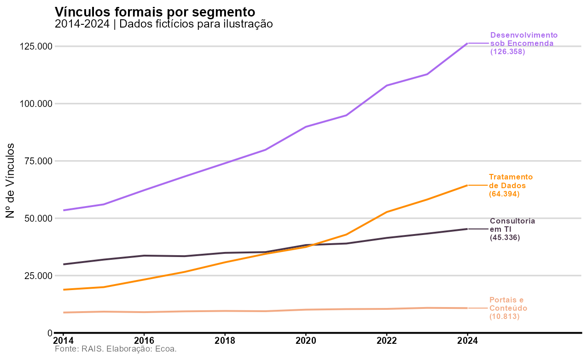
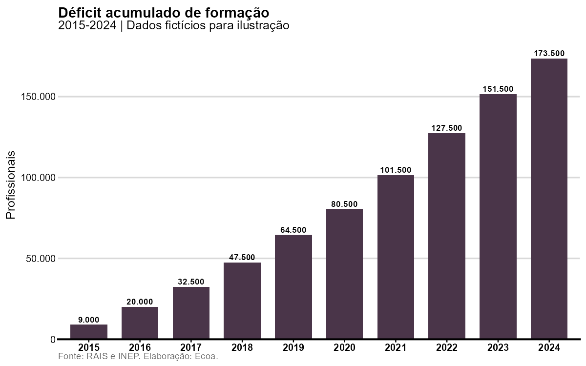
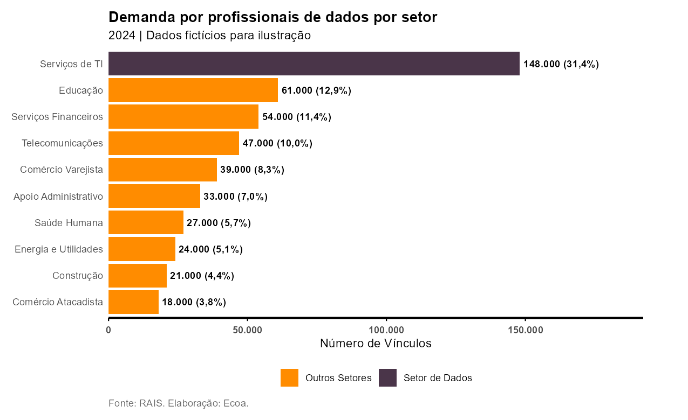
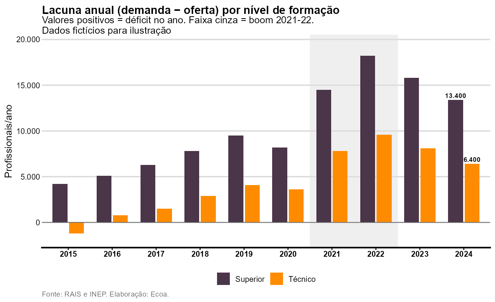
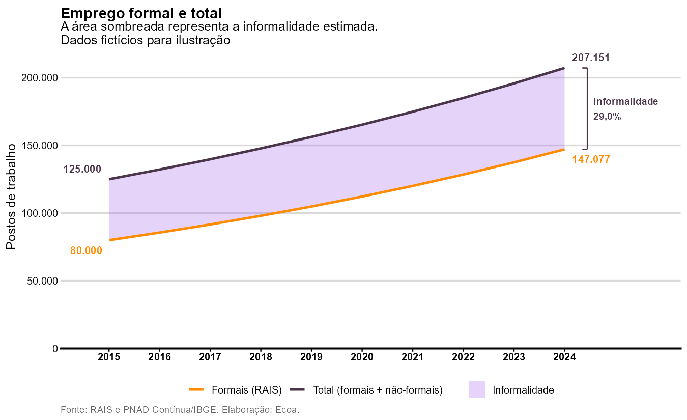

# Guia de Uso — Padrão de Gráficos Ecoa

Este guia define o padrão visual dos gráficos da **Ecoa Consultoria Econômica** em R, usando o pacote `vizecoa` com `ggplot2`. O modelo segue os gráficos elaborados no projeto GIZ.

Todos os exemplos abaixo usam dados fictícios e podem ser reproduzidos com o script [`gerar_imagens_guia.R`](gerar_imagens_guia.R).

## Índice

1. [O padrão em resumo](#1-o-padrão-em-resumo)
2. [Setup](#2-setup)
3. [O tema padrão: `theme_ecoa()`](#3-o-tema-padrão-theme_ecoa)
4. [Formatação de números](#4-formatação-de-números)
5. [Uso das cores](#5-uso-das-cores)
6. [Exemplos](#6-exemplos)
7. [Dicas gerais](#7-dicas-gerais)

---

## 1. O padrão em resumo

Checklist do gráfico padrão Ecoa:

- [ ] **Eixo Y começando do zero**, sem folga na base: `expand = expansion(mult = c(0, 0))`
- [ ] **Linha da origem do eixo X mais escura e um pouco mais grossa**: `axis.line.x = element_line(linewidth = 0.9)` (opcional, mas recomendado)
- [ ] Apenas **grade horizontal** em cinza-claro (`gray85`); sem grade vertical
- [ ] **Sem linha nem ticks no eixo Y**
- [ ] **Título em negrito**, **subtítulo em fonte normal** e **caption em cinza no canto inferior esquerdo** (`Fonte: ... Elaboração: Ecoa.`)
- [ ] Texto do **eixo X em negrito**
- [ ] **Números em formato brasileiro**: milhar com ponto, decimal com vírgula
- [ ] **Legenda embaixo, sem título** — ou substituída por rótulos diretos nas séries
- [ ] **Anotações são encorajadas**: rótulos de valores, faixas sombreadas para períodos relevantes, colchetes marcando diferenças
- [ ] Cores do pacote `vizecoa` (`scale_color_ecoa_d()` etc.) ou hex da paleta Ecoa atribuídos manualmente

## 2. Setup

```r
# Instalar o pacote (uma vez)
devtools::install_github("moreirasd/viz_ecoa")

# Pacotes usados no padrão
library(ggplot2)
library(dplyr)
library(vizecoa)
library(scales)    # formatação de números
library(ggrepel)   # rótulos nas pontas das linhas
library(patchwork) # composição de múltiplos gráficos (opcional)
```

## 3. O tema padrão: `theme_ecoa()`

Copie esta função para o início do seu script. Ela reúne o tema e a escala Y padrão (começando do zero, números pt-BR):

```r
theme_ecoa <- function(base_size = 12,
                       y_limits  = NULL,
                       y_breaks  = waiver(),
                       y_labels  = scales::label_number(big.mark = ".", decimal.mark = ","),
                       y_expand  = expansion(mult = c(0, 0))) {
  list(
    theme_classic(base_size = base_size) %+replace%
      theme(
        panel.grid.major.x = element_blank(),
        panel.grid.minor.x = element_blank(),
        panel.grid.major.y = element_line(color = "gray85", linewidth = 0.75),
        panel.grid.minor.y = element_blank(),
        axis.line.y        = element_blank(),
        axis.ticks.y       = element_blank(),
        axis.line.x        = element_line(linetype = "solid", linewidth = 0.9),
        axis.ticks         = element_line(),
        axis.text.x        = element_text(face = "bold"),
        legend.title       = element_blank(),
        legend.position    = "bottom",
        plot.title         = element_text(face = "bold", size = base_size + 2, hjust = 0),
        plot.subtitle      = element_text(hjust = 0),
        plot.caption       = element_text(hjust = 0, colour = "grey40", size = base_size - 3)
      ),
    scale_y_continuous(
      limits = y_limits,
      breaks = y_breaks,
      labels = y_labels,
      expand = y_expand
    )
  )
}
```

Como o tema já inclui a `scale_y_continuous`, ajuste o eixo Y pelos argumentos, e não adicionando outra escala:

| Situação | Chamada |
|----------|---------|
| Barras simples (padrão) | `theme_ecoa()` |
| Barras com rótulos em cima | `theme_ecoa(y_expand = expansion(mult = c(0, 0.1)))` |
| Linhas partindo do zero | `theme_ecoa(y_limits = c(0, NA), y_expand = expansion(mult = c(0, 0.05)))` |
| Valores negativos (ex.: lacunas) | `theme_ecoa(y_expand = expansion(mult = c(0.08, 0.12)))` + `geom_hline(yintercept = 0)` |
| Eixo em percentual | `theme_ecoa(y_labels = scales::label_percent(decimal.mark = ","))` |

> **Nota:** a preferência é que o gráfico comece do zero (`expand = expansion(mult = c(0, 0))`). As exceções acima existem só para abrir espaço para rótulos ou acomodar valores negativos.

## 4. Formatação de números

Sempre em formato brasileiro (milhar com ponto, decimal com vírgula):

```r
# Helper para rótulos em geom_text()
fmt <- function(x) trimws(format(round(x), big.mark = ".", decimal.mark = ",", scientific = FALSE))

# Em escalas
scales::label_number(big.mark = ".", decimal.mark = ",")
scales::label_percent(accuracy = 0.1, decimal.mark = ",")
scales::label_number(suffix = " Bi", accuracy = 1)   # valores em bilhões
```

## 5. Uso das cores

### Escalas automáticas

```r
scale_color_ecoa_d()             # séries categóricas (linhas, pontos)
scale_fill_ecoa_d()              # preenchimento categórico (barras)
scale_fill_ecoa()                # escala contínua (heatmaps)
scale_fill_ecoa_d(cinza = TRUE)  # muitas categorias: paleta com tons de cinza
```

### Atribuição manual (recomendada quando as categorias têm significado)

Convenções usadas nos projetos:

- **Roxos** (`#4a3549`, `#aa6aef`) para séries "frias": oferta, total, referência;
- **Laranjas/pêssego** (`#FF8C00`, `#f2aa84`) para séries "quentes": demanda, destaque;
- **Cinza** (`grey65`) para grupos de comparação/controle;
- Em rankings, destaque a categoria de interesse com uma cor e as demais com outra.

```r
# Destaque um-contra-todos
scale_fill_manual(values = c("Setor de Dados" = "#4a3549", "Outros Setores" = "#FF8C00"))

# Séries com papel semântico (pal[1] = roxo escuro ... pal[5] = laranja)
pal <- paleta_ecoa(5)
scale_fill_manual(values = c("Oferta" = pal[1], "Reposição" = pal[4], "Expansão" = pal[5]))

# Grupo de comparação em cinza
scale_fill_manual(values = c("Core Tech" = pal[1], "Comparáveis" = "grey65"))
```

Para pegar os códigos hex (útil também para PowerPoint): `hex_ecoa(5)` ou `hex_ecoa(8, cinza = TRUE)`.

## 6. Exemplos

### 6.1 Linha com rótulos no fim (substituindo a legenda)

Para séries temporais com poucas categorias, prefira rótulos diretos na ponta das linhas (via `ggrepel`) em vez de legenda. Reserve espaço à direita com `expand` no eixo X e use `coord_cartesian(clip = "off")`.

<p align="center">
  
</p>

```r
library(ggrepel)

dados_label <- df_linha |>
  filter(ano == max(ano)) |>
  mutate(label = paste0(segmento, "\n(", fmt(valor), ")"))

df_linha |>
  ggplot(aes(x = ano, y = valor, colour = segmento)) +
  geom_line(linewidth = 0.9) +
  geom_text_repel(
    data        = dados_label,
    aes(label   = label),
    nudge_x     = 0.5,          # empurra para a direita
    hjust       = 0,
    direction   = "y",          # só repele na vertical
    size        = 3,
    fontface    = "bold",
    lineheight  = 0.85,
    show.legend = FALSE
  ) +
  scale_color_ecoa_d() +
  scale_x_continuous(
    breaks = seq(2014, 2024, 2),
    expand = expansion(mult = c(0.02, 0.22))   # espaço extra à direita para os rótulos
  ) +
  coord_cartesian(clip = "off") +
  labs(
    x = NULL, y = "Nº de Vínculos",
    title    = "Vínculos formais por segmento",
    subtitle = "2014-2024",
    caption  = "Fonte: RAIS. Elaboração: Ecoa."
  ) +
  theme_ecoa(y_limits = c(0, NA), y_expand = expansion(mult = c(0, 0.05))) +
  theme(legend.position = "none")   # os rótulos substituem a legenda
```

### 6.2 Barras com rótulos

Rótulo em negrito acima de cada barra; folga extra no topo via `y_expand`.

<p align="center">
  
</p>

```r
df_deficit |>
  ggplot(aes(x = factor(ano), y = deficit)) +
  geom_col(fill = cores_ecoa[1], width = 0.72) +
  geom_text(aes(label = fmt(deficit)), vjust = -0.4, size = 3, fontface = "bold") +
  labs(
    x = NULL, y = "Profissionais",
    title    = "Déficit acumulado de formação",
    subtitle = "2015-2024",
    caption  = "Fonte: RAIS e INEP. Elaboração: Ecoa."
  ) +
  theme_ecoa(y_expand = expansion(mult = c(0, 0.1)))
```

### 6.3 Barras horizontais ordenadas com destaque

Para rankings: ordene com `fct_reorder()`, destaque a categoria de interesse com cor própria e coloque os valores à direita das barras. Aqui o eixo contínuo é o X, então o tema é ajustado manualmente (não use `theme_ecoa()`, que aplica escala no Y).

<p align="center">
  
</p>

```r
df_setores <- df_setores |>
  mutate(
    setor = fct_reorder(setor, vinculos),
    label = paste0(fmt(vinculos), " (", percent(perc, accuracy = 0.1, decimal.mark = ","), ")")
  )

df_setores |>
  ggplot(aes(x = vinculos, y = setor, fill = tipo)) +
  geom_col() +
  geom_text(aes(label = label), hjust = -0.05, size = 3.2, fontface = "bold") +
  scale_fill_manual(values = c("Setor de Dados" = "#4a3549", "Outros Setores" = "#FF8C00")) +
  scale_x_continuous(
    labels = label_number(big.mark = ".", decimal.mark = ","),
    expand = expansion(mult = c(0, 0.30))   # espaço à direita para os rótulos
  ) +
  labs(x = "Número de Vínculos", y = NULL, fill = NULL,
       title    = "Demanda por profissionais de dados por setor",
       subtitle = "2024",
       caption  = "Fonte: RAIS. Elaboração: Ecoa.") +
  theme_minimal() +
  theme(
    panel.grid.major.x = element_blank(),
    panel.grid.major.y = element_blank(),
    panel.grid.minor.x = element_blank(),
    axis.line.x        = element_line(linetype = "solid", linewidth = 0.9),
    axis.line.y        = element_blank(),
    axis.ticks.x       = element_line(),
    axis.ticks.y       = element_blank(),
    axis.text.x        = element_text(face = "bold"),
    legend.title       = element_blank(),
    legend.position    = "bottom",
    plot.title         = element_text(face = "bold"),
    plot.caption       = element_text(hjust = 0, colour = "grey40"),
    plot.margin        = margin(t = 10, r = 40, b = 10, l = 10)
  )
```

### 6.4 Barras agrupadas com faixa sombreada

Barras lado a lado (`position_dodge`), rótulos só no último ano para não poluir, faixa cinza (`annotate("rect")`) destacando um período relevante e linha do zero quando há valores negativos.

<p align="center">
  
</p>

```r
pal        <- paleta_ecoa(5)
col_niveis <- c("Superior" = pal[1], "Técnico" = pal[5])

labels_fim <- df_gap |> filter(ano == max(ano))

df_gap |>
  ggplot(aes(x = factor(ano), y = lacuna, fill = nivel)) +
  annotate("rect", xmin = 6.5, xmax = 8.5, ymin = -Inf, ymax = Inf,
           fill = "grey88", alpha = 0.5) +                       # faixa = boom 2021-22
  geom_col(position = position_dodge(width = 0.75), width = 0.68) +
  geom_hline(yintercept = 0, linewidth = 0.4, colour = "grey40") +
  geom_text(
    data = labels_fim,
    aes(label = fmt(lacuna)),
    position = position_dodge(width = 0.75),
    vjust = -0.4, size = 3, fontface = "bold", show.legend = FALSE
  ) +
  scale_fill_manual(values = col_niveis) +
  labs(
    x = NULL, y = "Profissionais/ano",
    title    = "Lacuna anual (demanda − oferta) por nível de formação",
    subtitle = "Valores positivos = déficit no ano. Faixa cinza = boom 2021-22",
    caption  = "Fonte: RAIS e INEP. Elaboração: Ecoa."
  ) +
  theme_ecoa(y_expand = expansion(mult = c(0.08, 0.12)))   # folga p/ negativos e rótulos
```

### 6.5 Anotações: área sombreada e colchete de diferença

O padrão encoraja anotações que expliquem o gráfico por si só: valores nas pontas das séries, área sombreada entre linhas (`geom_ribbon`) e colchete anotando a diferença (`annotate("segment")` + `annotate("text")`).

<p align="center">
  
</p>

```r
fim <- df_inf |> filter(ano == max(ano))

df_inf |>
  ggplot(aes(x = ano)) +
  geom_ribbon(aes(ymin = formais, ymax = total, fill = "Informalidade"), alpha = 0.30) +
  geom_line(aes(y = total,   colour = "Total (formais + não-formais)"), linewidth = 1.1) +
  geom_line(aes(y = formais, colour = "Formais (RAIS)"), linewidth = 1.1) +
  # Rótulos nas pontas das séries
  geom_text(
    data = df_inf |> filter(ano %in% range(ano)),
    aes(y = total, label = fmt(total),
        hjust = if_else(ano == min(ano), 1.2, -0.2)),
    vjust = -0.9, colour = "#4a3549", size = 3.5, fontface = "bold"
  ) +
  geom_text(
    data = df_inf |> filter(ano %in% range(ano)),
    aes(y = formais, label = fmt(formais),
        hjust = if_else(ano == min(ano), 1.2, -0.2)),
    vjust = 1.8, colour = "#FF8C00", size = 3.5, fontface = "bold"
  ) +
  # Colchete anotando a diferença no último ano
  annotate("segment", x = fim$ano + 0.45, xend = fim$ano + 0.45,
           y = fim$formais, yend = fim$total, colour = "#4a3549", linewidth = 0.6) +
  annotate("segment", x = fim$ano + 0.35, xend = fim$ano + 0.45,
           y = fim$formais, yend = fim$formais, colour = "#4a3549", linewidth = 0.6) +
  annotate("segment", x = fim$ano + 0.35, xend = fim$ano + 0.45,
           y = fim$total, yend = fim$total, colour = "#4a3549", linewidth = 0.6) +
  annotate("text", x = fim$ano + 0.57,
           y = fim$formais + (fim$total - fim$formais) * 0.5,
           label = paste0("Informalidade\n",
                          label_percent(accuracy = 0.1, decimal.mark = ",")(fim$taxa)),
           hjust = 0, colour = "#4a3549", fontface = "bold", size = 3.3) +
  scale_colour_manual(
    values = c("Total (formais + não-formais)" = "#4a3549",
               "Formais (RAIS)"                = "#FF8C00")
  ) +
  scale_fill_manual(values = c("Informalidade" = "#aa6aef")) +
  scale_x_continuous(breaks = anos_inf, expand = expansion(mult = c(0.10, 0.18))) +
  coord_cartesian(clip = "off") +
  labs(
    x = NULL, y = "Postos de trabalho", colour = NULL, fill = NULL,
    title    = "Emprego formal e total",
    subtitle = "A área sombreada representa a informalidade estimada",
    caption  = "Fonte: RAIS e PNAD Contínua/IBGE. Elaboração: Ecoa."
  ) +
  theme_ecoa(y_limits = c(0, NA), y_expand = expansion(mult = c(0, 0.08)))
```

## 7. Dicas gerais

- **`coord_cartesian(clip = "off")`** sempre que houver rótulos ou anotações fora da área do painel;
- **`expand` no eixo X** para abrir espaço para rótulos nas pontas (`expansion(mult = c(0.02, 0.22))` à direita, ou folga nos dois lados quando há rótulos no início e no fim);
- **Legenda em duas linhas** quando houver muitas categorias: `guides(colour = guide_legend(nrow = 2))`;
- **Composição de painéis** com `patchwork`: `p1 + p2 + p3 + plot_layout(ncol = 3)` (um tema por painel; título geral com `plot_annotation()`);
- **Exportação**: `ggsave("figura.png", plot, width = 9, height = 5.5, dpi = 150, bg = "white")` — largura 8–9 para gráficos únicos, altura 5–6.5;
- **Facetas**: com `facet_wrap()`, adicione `strip.text = element_text(face = "bold")` ao tema.
