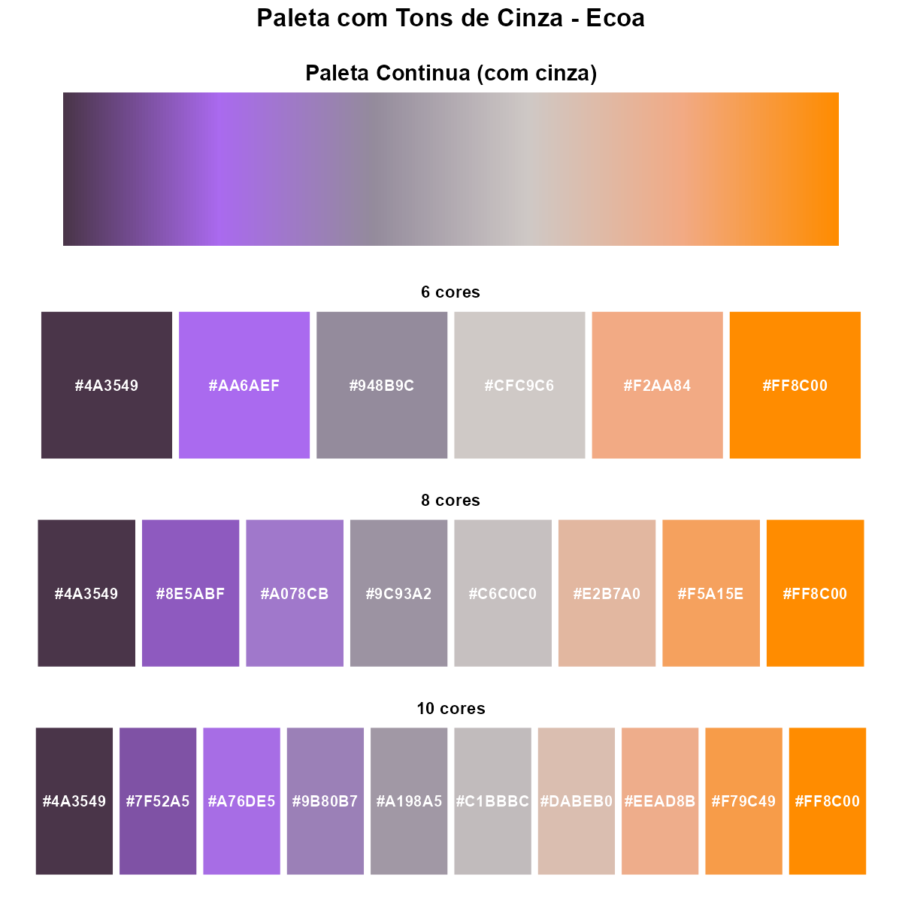
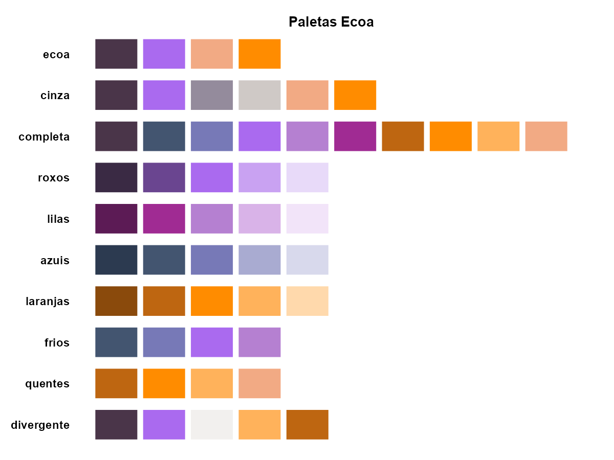
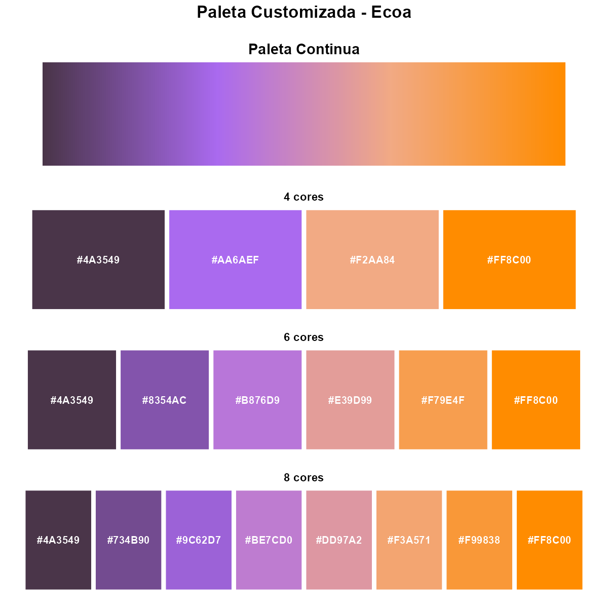
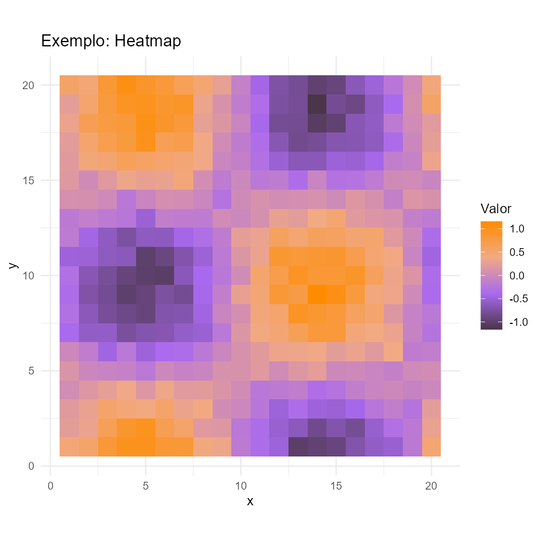
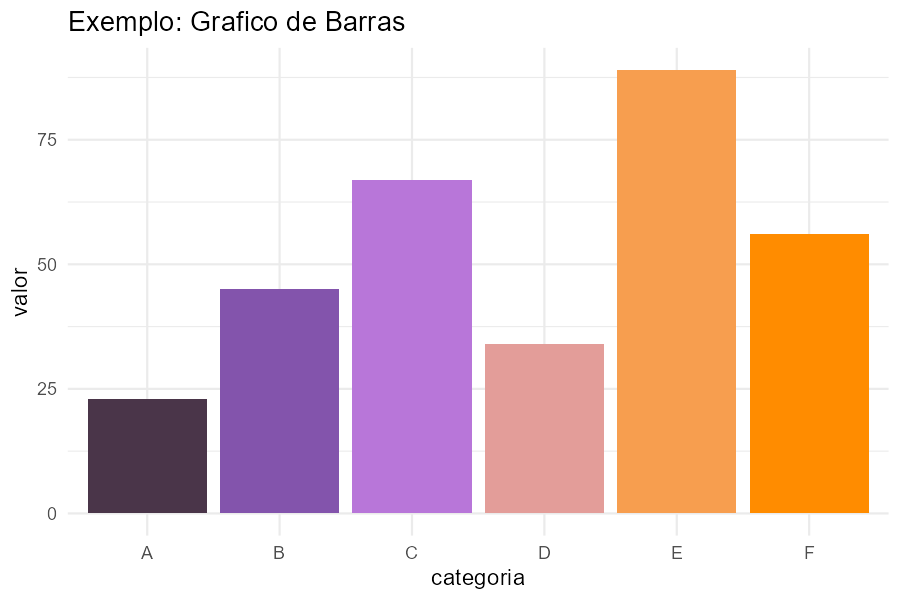
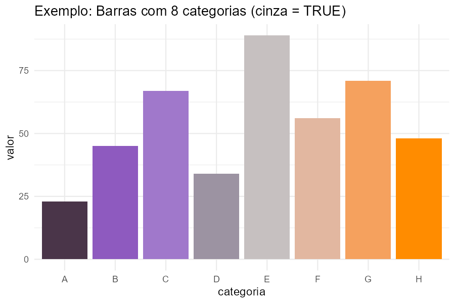
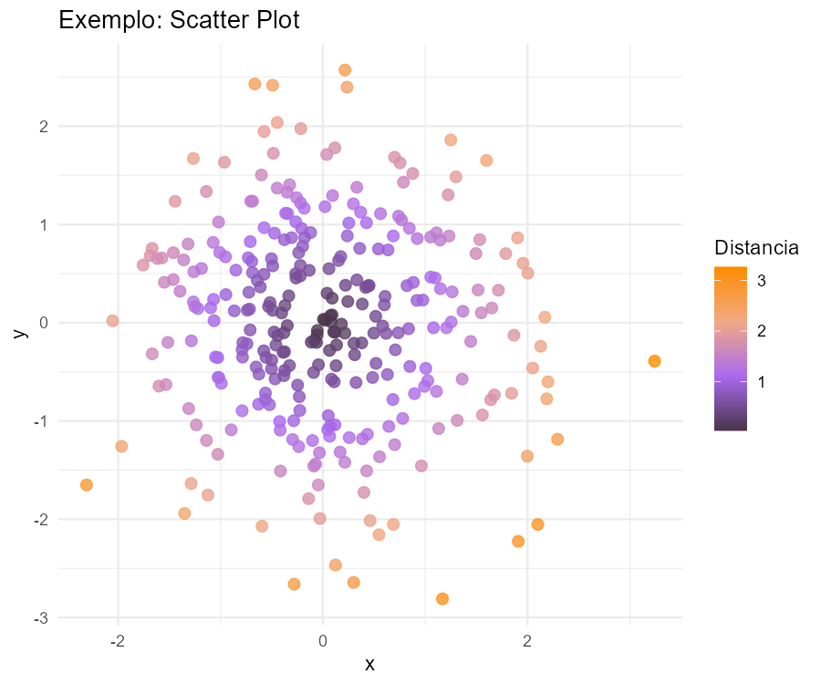

# vizecoa

Paleta de cores e escalas ggplot2 para a **Ecoa Consultoria Economica**.

## Objetivo

O pacote `vizecoa` fornece uma paleta de cores personalizada baseada nas cores institucionais da Ecoa, com funcoes prontas para uso em graficos `ggplot2`. O objetivo e padronizar as visualizacoes de dados em projetos da consultoria.

> **Novo:** consulte o [**Guia de Uso**](GUIA_DE_USO.md) para o padrao completo de graficos Ecoa — tema padrao (`theme_ecoa`), formatacao de numeros pt-BR, convencoes de cores e exemplos prontos (linhas com rotulos, barras, anotacoes). Para Excel, use o [modelo com graficos nativos](excel/modelo_graficos_ecoa.xlsx) ja formatados no padrao.

## Instalacao

### Via GitHub (recomendado)

```r
# Instalar devtools se necessario
install.packages("devtools")

# Instalar vizecoa do GitHub
devtools::install_github("moreirasd/viz_ecoa")
```


## Cores da Paleta

A paleta Ecoa e composta por 4 cores base que sao interpoladas para criar gradientes:

| Cor | Hex | Descricao |
|:---:|:---:|-----------|
|  | `#4a3549` | Roxo escuro |
|  | `#aa6aef` | Roxo claro |
|  | `#f2aa84` | Pessego |
|  | `#FF8C00` | Laranja |

### Variacao com tons de cinza

Para graficos com muitas categorias, ha uma variacao da paleta com tons de cinza na transicao entre o roxo e o laranja. Os cinzas desaturam o meio da paleta, tornando as cores intermediarias mais distinguiveis entre si. Basta usar `cinza = TRUE` em qualquer funcao do pacote.

| Cor | Hex | Descricao |
|:---:|:---:|-----------|
|  | `#4a3549` | Roxo escuro |
|  | `#aa6aef` | Roxo claro |
|  | `#948b9c` | Cinza arroxeado |
|  | `#cfc9c6` | Cinza claro |
|  | `#f2aa84` | Pessego |
|  | `#FF8C00` | Laranja |

<p align="center">
  
</p>

## Conjunto de Paletas

Alem da paleta padrao, o pacote traz um conjunto de paletas nomeadas, no estilo do RColorBrewer. Todas as funcoes aceitam o argumento `paleta = "nome"`:

<p align="center">
  
</p>

| Paleta | Tipo | Cores | Uso indicado |
|--------|------|:-----:|--------------|
| `ecoa` | principal | 4 | Padrao: roxos e laranjas |
| `cinza` | principal | 6 | Padrao com cinzas na transicao, para mais categorias |
| `completa` | qualitativa | 10 | Muitas categorias: espectro continuo (frios -> quentes) com roxos, azuis, lilas e laranjas do tema institucional |
| `roxos` | sequencial | 5 | Dados ordenados/continuos em tons de roxo |
| `lilas` | sequencial | 5 | Dados ordenados/continuos em tons de lilas/magenta |
| `azuis` | sequencial | 5 | Dados ordenados/continuos em tons de azul |
| `laranjas` | sequencial | 5 | Dados ordenados/continuos em tons de laranja |
| `frios` | sequencial | 4 | Tons frios (convencao: oferta/total) |
| `quentes` | sequencial | 4 | Tons quentes (convencao: demanda/destaque) |
| `divergente` | divergente | 5 | Desvios em torno de um centro (roxo <- neutro -> laranja) |

```r
# Explorar as paletas
mostrar_paletas()      # grafico com todas
paletas_ecoa_info      # tabela com tipo e numero de cores
paletas_ecoa$azuis     # vetor de cores de uma paleta

# Usar nas escalas
scale_fill_ecoa_d(paleta = "completa")   # barras com muitas categorias
scale_fill_ecoa(paleta = "roxos")        # heatmap sequencial
scale_color_ecoa(paleta = "divergente")  # desvios em torno de um centro
hex_ecoa(6, paleta = "laranjas")         # hex codes para PPT/Excel
```

As paletas qualitativas (`completa`) retornam cores exatas ate o limite, selecionadas em posicoes igualmente espacadas ao longo do espectro — com poucas categorias as cores continuam bem contrastadas, e com muitas a sequencia mantem transicao suave. As demais paletas sao interpoladas para qualquer `n`.

## Funcoes Disponiveis

Todas as funcoes de paleta aceitam `paleta = "nome"` (padrao: `"ecoa"`); `cinza = TRUE` segue funcionando como atalho para `paleta = "cinza"`.

| Funcao | Descricao |
|--------|-----------|
| `cores_ecoa` | Vetor com as 4 cores base da Ecoa |
| `cores_ecoa_cinza` | Vetor com as 6 cores da variacao com cinza |
| `paletas_ecoa` | Lista com todas as paletas nomeadas |
| `paletas_ecoa_info` | Tabela com tipo e numero de cores de cada paleta |
| `paleta_ecoa(n, paleta)` | Gera n cores de qualquer paleta |
| `scale_fill_ecoa()` | Escala de preenchimento continua para ggplot2 |
| `scale_color_ecoa()` | Escala de cor continua para ggplot2 |
| `scale_fill_ecoa_d()` | Escala de preenchimento discreta para ggplot2 |
| `scale_color_ecoa_d()` | Escala de cor discreta para ggplot2 |
| `theme_ecoa()` | Tema padrao dos graficos Ecoa (ver [Guia de Uso](GUIA_DE_USO.md)) |
| `mostrar_paleta(n, paleta)` | Visualiza n cores de uma paleta com codigos hex |
| `mostrar_paletas()` | Visualiza todas as paletas em um grafico |
| `hex_ecoa(n, paleta)` | Retorna os codigos hex de n cores (util para PPT) |

## Visualizacao da Paleta

<p align="center">
  
</p>

### Carregar os pacotes

```r
library(vizecoa)
library(ggplot2)
library(patchwork)
```

### Paleta continua

```r
df_continua <- data.frame(x = 1:256, y = 1)

p1 <- ggplot(df_continua, aes(x = x, y = y, fill = x)) +
  geom_tile() +
  scale_fill_gradientn(colors = paleta_ecoa(256)) +
  theme_void() +
  theme(legend.position = "none",
        plot.title = element_text(hjust = 0.5, size = 14, face = "bold"),
        plot.margin = margin(10, 10, 10, 10)) +
  labs(title = "Paleta Continua")

print(p1)
```

### Paleta discreta

```r
# Visualizar diferentes quantidades de cores
p2 <- mostrar_paleta(4)
p3 <- mostrar_paleta(6)
p4 <- mostrar_paleta(8)

# Combinar visualizacoes
plot_paleta <- p1 / p2 / p3 / p4 +
  plot_annotation(
    title = "Paleta Customizada - Ecoa",
    theme = theme(plot.title = element_text(hjust = 0.5, size = 16, face = "bold"))
  )

print(plot_paleta)
```

## Exemplos de Uso

### Exemplo 1: Heatmap (escala continua)

```r
set.seed(42)
df_heat <- expand.grid(x = 1:20, y = 1:20)
df_heat$z <- with(df_heat, sin(x/3) * cos(y/3) + rnorm(400, sd = 0.1))

p_heat <- ggplot(df_heat, aes(x = x, y = y, fill = z)) +
  geom_tile() +
  scale_fill_ecoa() +
  theme_minimal() +
  labs(title = "Exemplo: Heatmap", fill = "Valor") +
  coord_equal()

print(p_heat)
```

<p align="center">
  
</p>


### Exemplo 2: Grafico de barras (escala discreta)

```r
df_bar <- data.frame(
  categoria = LETTERS[1:6],
  valor = c(23, 45, 67, 34, 89, 56)
)

p_bar <- ggplot(df_bar, aes(x = categoria, y = valor, fill = categoria)) +
  geom_col() +
  scale_fill_ecoa_d() +
  theme_minimal() +
  labs(title = "Exemplo: Grafico de Barras") +
  theme(legend.position = "none")

print(p_bar)
```
<p align="center">
  
</p>


### Exemplo 3: Muitas categorias (paleta com cinza)

Quando ha muitas categorias, use `cinza = TRUE` para obter cores intermediarias mais distinguiveis:

```r
df_bar8 <- data.frame(
  categoria = LETTERS[1:8],
  valor = c(23, 45, 67, 34, 89, 56, 71, 48)
)

p_bar_cinza <- ggplot(df_bar8, aes(x = categoria, y = valor, fill = categoria)) +
  geom_col() +
  scale_fill_ecoa_d(cinza = TRUE) +
  theme_minimal() +
  labs(title = "Exemplo: Barras com 8 categorias") +
  theme(legend.position = "none")

print(p_bar_cinza)
```
<p align="center">
  
</p>


### Exemplo 4: Scatter plot (escala continua de cor)

```r
set.seed(123)
df_scatter <- data.frame(
  x = rnorm(300),
  y = rnorm(300)
)
df_scatter$dist <- sqrt(df_scatter$x^2 + df_scatter$y^2)

p_scatter <- ggplot(df_scatter, aes(x = x, y = y, color = dist)) +
  geom_point(size = 2.5, alpha = 0.8) +
  scale_color_ecoa() +
  theme_minimal() +
  labs(title = "Exemplo: Scatter Plot", color = "Distancia")

print(p_scatter)
```
<p align="center">
  
</p>


#### Exemplo 5: Obter somente os HEX codes.

```r
hex_ecoa(4)
#> 4 cores: #4A3549, #AA6AEF, #F2AA84, #FF8C00

hex_ecoa(5)
#> 5 cores: ...

hex_ecoa(6)
#> 6 cores: ...

# Paleta com tons de cinza
hex_ecoa(8, cinza = TRUE)
#> 8 cores: #4A3549, #8E5ABF, #A078CB, #9C93A2, #C6C0C0, #E2B7A0, #F5A15E, #FF8C00

hex_ecoa(10)
#> 10 cores: ...
```

## Dependencias

- `ggplot2` (obrigatoria)
- `patchwork` (opcional, para combinar graficos)

